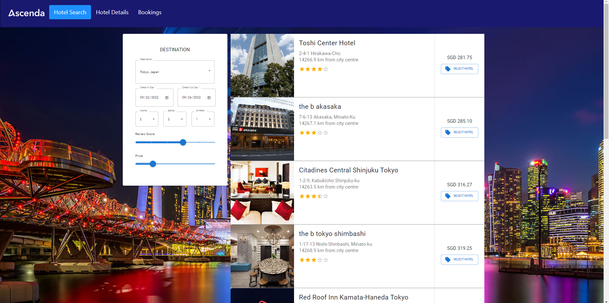
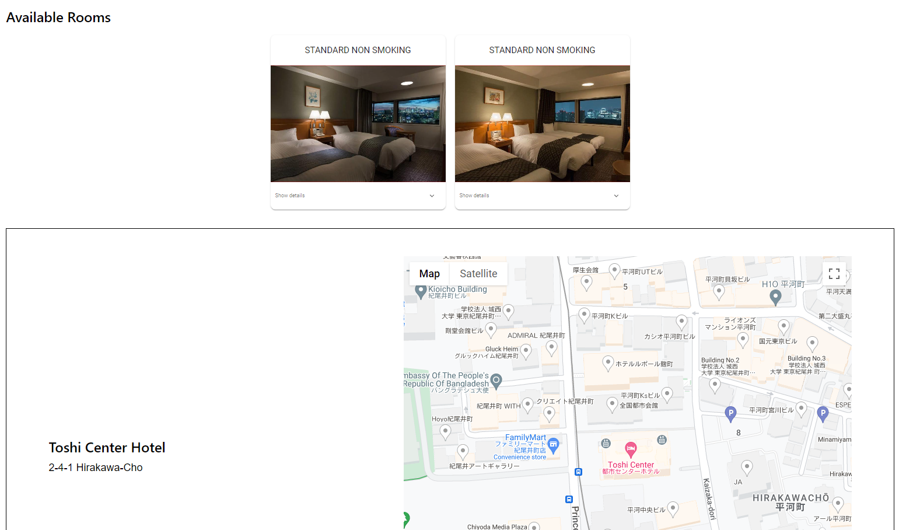

# 50.003_ESC_Project

A hotel search and booking web application with Ascenda.

<div align="center">

<br>

</div>

## Environment setup
Create your conda environment or python venv and run the following in it. 
If unsure, refer to https://packaging.python.org/en/latest/guides/installing-using-pip-and-virtual-environments/.
```
python -m pip install -U --force-reinstall -r requirements.txt  # use pip3 for Linux
cd ascendaApp/
npm install # in ./ascendaApp
```

## Run app locally
1. Run the following on separate terminals in `./ascendaApp`
```
python manage.py runserver # django
npm start                  # react
```
2. Visit localhost:3000

## Test locally
```
python manage.py runserver                        # run server for selenium
npx mocha src/selenium/test.js --no-timeouts      # run individual selenium test file
npx mocha src/selenium --no-timeouts --recursive  # run all selenium tests
./node_modules/.bin/jest ./src/components/        # run all unit tests
```

## Change database models
Refer to this guide for Django-REST: https://www.digitalocean.com/community/tutorials/build-a-to-do-application-using-django-and-react
```
python manage.py makemigrations ascendaApp  # update migrations from Django models
python manage.py sqlmigrate ascendaApp 0001 # returns SQL from migrations
python manage.py migrate                    # apply migrations
python manage.py createsuperuser            # create admin
```

## Experiment with django shell
```
python manage.py shell # run cli with django project environment

from ascendaApp.models import Hotel
from ascendaApp.views import HotelSerializer
from django.utils import timezone

Hotel.objects.all().count()
Hotel.objects.filter(name__startswith='Park').get() # __ to chain relationships, question__dat__year
Hotel.objects.get(pk=1).delete()
h7 = Hotel.objects.filter(id=7).get()
HotelSerializer(h7).data

h1 = Hotel(name='Studio M Hotel', reviewScore=3.69, price=450.0, address='3 Nanson Road', lat=1.29088, lng=103.83904)
h1.save()
h2 = Hotel(name='Park Hotel Clarke Quay', reviewScore=2.69, price=302.0, address='1 Unity Street', lat=1.29148, lng=103.8424)
h2.save()
h3 = Hotel(name='Aqueen Hotel Paya Lebar', reviewScore=4.69, price=192.0, address='33 Jalan Afifi', lat=1.32218, lng=103.89177)
h3.save()
```

## Experiment with sqlite3 and Django Cryptography encryption
```
sqlite3  db.sqlite3
SELECT * FROM ascendaApp_bookinginfo;
```

## Project structure
```
└───ascendaApp:
    ├───ascendaApp      django project
    ├───hotelSearch     django app
        ├───settings.py   configure django project
        ├───urls.py       url declarations, i.e. table of contents
        ├───asgi.py       entry point for asgi web servers
        ├───wsgi.py       entry point for wsgi web servers
        └───...
    ├───public          public assets
        ├───index.html    page template
        └───...
    ├───src             js and css here
        ├───index.js      entry point
        └───...
    ├───manage.py       
    └───...
```

## Project creation
Refer to this guide to setup: https://alphacoder.xyz/dead-simple-react-django-setup/
```
# Django setup
pip install django
django-admin startproject ascendaDjango
django-admin startapp ascendaApp
# add ascendaApp to INSTALLED_APPS in ascendaApp/ascendaApp/settings.py
# add react directory to urlpatterns in ascendaApp/ascendaApp/url.py

# React setup
npm install -g create-react-app
create-react-app ascenda-app
mv ascenda-app/*
```